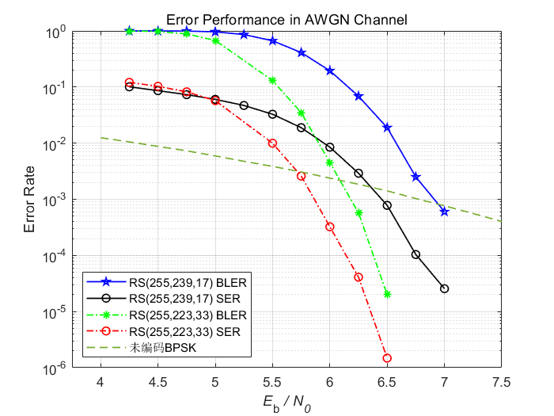
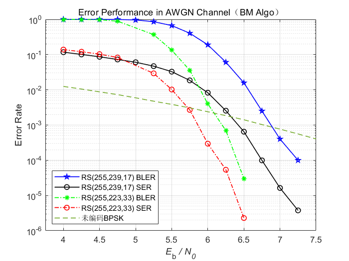

---
useMath:true
---

# Reed-Solomon（RS）码的编译码与仿真


|         |                                                        |
| ------- | ------------------------------------------------------ |
| Author  | Nnoduka Eruchalu                                       |
| Date    | 03/16/2014                                             |
|         |                                                
| Author  | He Guanchen                                      |
| Date    | 03/11/2022                                             |


本次实验参考了Nnoduka Eruchalu在Github上的代码。由于源代码已经完成了RS码的编码器与基于**欧几里得算法**的译码器，并且在**多远对称信道**已经完成了仿真，本人考虑将他的代码应用于**BPSK调制**后进入**AWGN**信道进行仿真。并且由于**Berlekamp Massey算法**在解递归方程组时效率更高，本人重新编写了基于**BM算法**的译码器。

## 注意
核心代码已被修改，目前有效代码仅有`main.cpp`,`reedSolomon.cpp`,`reedSolomon.h`与`primitives.h`


## 编程语言
* C++


------------------------------------------------------
## 以下工作由Nnoduka Eruchalu完成

## About RS Encoder/Decoder + Channel Simulation
#### Description Of Error Correcting Code
I implemented the t-error-correcting Reed-Solomon code of field size `2^m` and
length `n = 2^m -1`, where `m` and `t` are variable input parameters. Note that `k = n-2t`.
This arithmetic is implemented over fields of characteristic 2.


#### Encoder
* `alpha` is the root of primitive polynomial of order `m`
* First the generator polynomial for the RS code is formed by following the equation:
  
  ```  
  g(x) = (x - alpha)(x - alpha^2)...(x - alpha^2t)
  ```
  Because we are working with mod2, - and + are interchangeable, so:
  ```  
  g(x) = (x + alpha)(x + alpha^2)...(x + alpha^2t)
  ```

* Given a message vector `m = (m_0, m_1,... m_(k-1))` its corresponding message
polynomial is: 
  
  ```
  m(x) = m_0 + m_1*x + ... + m_(k-1)*x^(k-1)
  ```
  where each `m_i` is in a Galois Field with `2^m` elements, `GF(2^m)`.
  The systematic encoding process produces a codeword defined by:
  ```
  c(x) = m(x)*x^(n-k) + [m(x)*x^(n-k)]%g(x)
  ```


#### Decoder
Given a received vector `rc(x)` the algebraic decoding of the Reed-Solomon code
has the following steps:
* **Computation of the syndrome**
  The syndromes are:
  
  ````
  S_1 = rc(alpha)`;   S_2 = rc(a^2);   ...     ; S_2t = rc(a^2t)
  ```
  And the syndrome polynomial is:
  ```
  s(x) = S_1 + S_2*x + ... + S_2t*x^(2t-1)
  ```
  
* **Determination of the error locator polynomial using the Euclidean Algorithm** 
  This runs the extended euclidean algorithm with: 
  `a(x) = x^2t` and `b(x) = s(x)`, until `deg(r_i(x)) < t`.
  At this terminating value of `i`:
  * The error magnitude/value/evaluator polynomial: `omega(x) = r_i(x)/t_i(0)` 
  * The error locator polynomial: `lambda(x) = t_i(x)/t_i(0)`
  
  Below is the euclidean algorithm in pseudo-code:
  ```
  Initialization: r_(-1)(x) = a(x);   r_0(x) = b(x); 
                  s_(-1)(x) = 1;      s_0(x) = 0
                  t_(-1)(x) = 0;      t_0(x) = 1;
  while(deg(r_i(x)) >= t)
  {
     // compute quotient[q_i(x)] and remainder [r_i(x)]
     q_i(x) = r_(i-2)(x) / r_(i-1)(x)    
     r_i(x) = r_(i-2)(x) % r_(i-1)(x) = r_(i-2)(x) - q_i(x)*r_(i-1)(x)
     s_i(x) = s_(i-2)(x) - q_i(x)*s_(i-1)(x) 
     t_i(x) = t_(i-2)(x) - q_i(x)*t_(i-1)(x) 
  }
  ```

* **Finding the roots of the error locator polynomial using the Chien search**
  The Chien search is an exhaustive search over all the elements in the field.
  Remember that the error locator polynomial is `lambda(x)`.
  So the Chien search goes through all the elements of the `GF(2^m)` field: (`alpha^0` to `alpha^(n-1)`) and if `lambda(alpha^i) == 0` then an error has been located at `(alpha^i)^-1` = `alpha^(n-i)`
  This can be interpreted as an error at location `(n-i)`

* **Determine error values at error locations using Forney's Algorithm**
  Forney's algorithm states that the error values for a Reed-Solomon code are computed by:
  ```
  e_ik = omega(X_k^-1)/derivative[lambda(X_k^-1)] 
  ```
  where `X_k^-1` is a root of `lambda(x) and `i` is the index of the error location.

* **Finally determine the decoded codeword**
  The decoded codeword `dc(x)` is determined with this logic:
  ```
  FOR all codewords indexed by i FROM 0 to n-1
    if(at error location) dc_i = rc_i + e
    else                  dc_i = rc_i
  ```
 
#### Channel Model:
The codewords `(c_0, c_1, ..., c_(n-1))` are transmitted over a channel where symbol errors occur independently with probability `Ps`. 
That is each received symbol `rc_i = c_i + e_i`, where `rc_i`, `c_i`, `e_i` are in `GF(2^m)` and
```
                |1-Ps        if a == 0
Prob(e_k = a) = |
                |Ps/(2^m-1)  if a != 0
```

#### Symmetric Channel Simulation
I determined the performance of the Reed-Solomon codes for two different
choices of code parameters: 
* `m=7, t=60`
* `m=7, t=30`

For each pair of m,t values the simulation outputs a plot of RS encoder/decoder's error rate as a function of the probability of channel error, Ps.
This simulation showed that smaller t-values resulted in a faster rise to an error rate of 1 with increasing Ps values.

###### Simulation Plot for m=7, t=60:
[![m=7, t=60][m7t60.jpg]][m7t60.jpg]

###### Simulation Plot for m=7, t=30:
[![m=7, t=30][m7t30.jpg]][m7t30.jpg]

[m7t60.jpg]: https://s3.amazonaws.com/projects.nnoduka.com/reed_solomon/m7t60.jpg "Simulation Plot for m=7, t=60"
[m7t30.jpg]: https://s3.amazonaws.com/projects.nnoduka.com/reed_solomon/m7t30.jpg "Simulation Plot for m=7, t=30"


####

#### References
Read the following for more background information:
* [Reed-Solomon Error Correction by C.K.P. Clarke of BBC's R&D](http://downloads.bbc.co.uk/rd/pubs/whp/whp-pdf-files/WHP031.pdf)

------------------------------------------------------


## 以下结果由He Guanchen完成

#### BPSK+AWGN Simulation

###### Simulation Plot for Euclidean+Forney decoder:


###### Simulation Plot for BM+Forney decoder:



## Software Description
| Module             | Description                                             |
| ------------------ | ------------------------------------------------------- |
| `main.cpp`         | Program's main loop that runs simulation                |
| `primitives.h`     | List of finite field primitive polynomials              |
| `reedSolomon.h`    | Class interface for RS encoder/decoder object           |
| `reedSolomon.cpp`  | Class implementation for RS encoder/decoder object      |
| `simulation/`      | Folder containing screenshots of simulation             |


## Compiling
In **Terminal**, enter `g++ main.cpp reedSolomon.cpp -o main.exe` to create the binary executable file main.exe


## Running
In **Terminal**, enter './main.exe' to run the code.


## 代码修改
所有函数定义代码全部在 `reedSolomon.cpp` 文件中，`main.cpp`文件用于定义主程序，`reedSolomon.h`文件仅仅用于声明`reedSolomon`对象, `primitives.h`只用于存储本原多项式。

